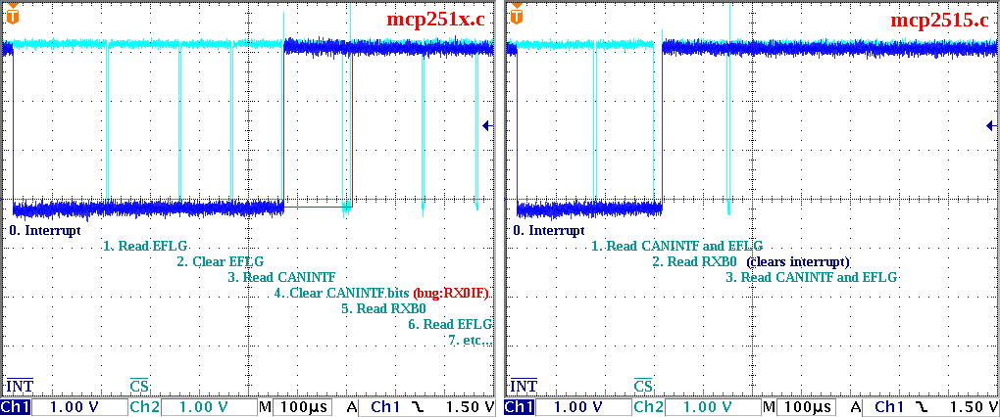
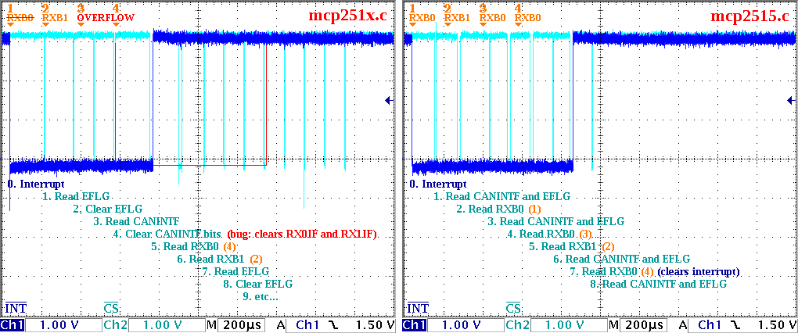

# linux-mcp2515

Linux driver for the Microchip MCP2515 CAN controller.

This is an alternative driver (unrelated to the mcp251x driver in the
mainline Linux) that uses the asynchronous SPI API directly, eliminating
the overhead of threads, work queues and synchronous SPI wrappers, thus
reducing SPI transaction latency to a minimum, to reduce buffer overflows.

Here are a couple of oscilloscope captures comparing the behaviour
of the mcp251x driver and this mcp2515 driver, on Linux 2.6:

- Reception of 1 CAN frame:

- Reception of 4 consecutive CAN frames:

This driver is distributed as a patch file (linux-mcp2515.patch) for Linux 2.6.
It was sent to the Linux Socket-CAN Core development mailing-list on 18 Oct 2010:
http://socket-can.996257.n3.nabble.com/PATCH-can-mcp2515-add-spi-async-driver-for-MCP2515-td7012.html

## License

This program is free software; you can redistribute it and/or modify
it under the terms of the GNU General Public License as published by
the Free Software Foundation; either version 2 of the License, or
(at your option) any later version.

This program is distributed in the hope that it will be useful,
but WITHOUT ANY WARRANTY; without even the implied warranty of
MERCHANTABILITY or FITNESS FOR A PARTICULAR PURPOSE.  See the
GNU General Public License in the LICENSE file for more details.
